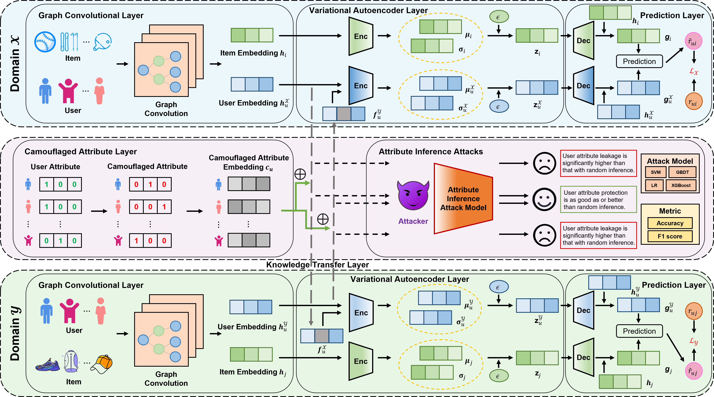
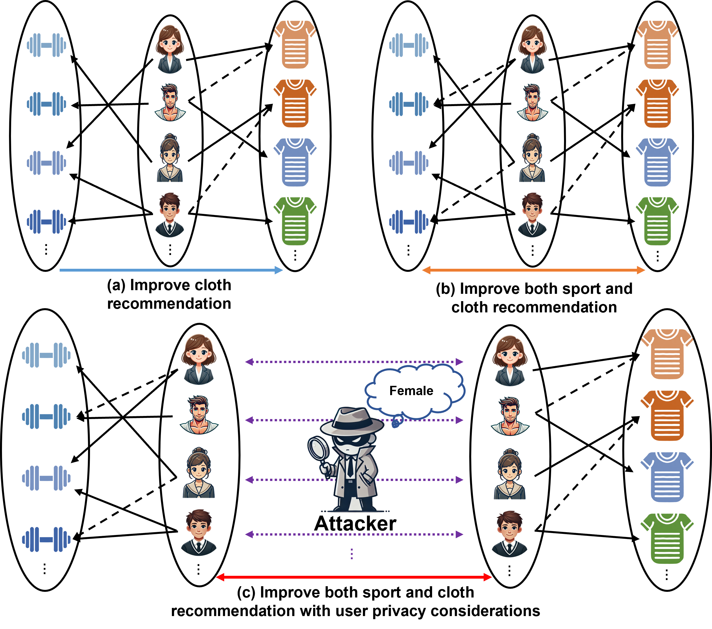

# CVGAE

> [**Camouflaged Variational Graph AutoEncoder against Attribute Inference Attacks for Cross-Domain Recommendation**](https://doi.org/10.1109/TKDE.2025.3565793)               
> Yudi Xiong, Yongxin Guo, Weike Pan, Qiang Yang, Zhong Ming, Xiaojin Zhang, Han Yu, Tao Lin and Xiaoying Tang
> 
> *[DOI Bookmark:10.1109/TKDE.2025.3565793](https://doi.org/10.1109/TKDE.2025.3565793)* 

[](https://doi.org/10.1109/TKDE.2025.3565793) | [](https://github.com/ambv/black) | [](https://pytorch.org/) | [](https://www.python.org/) |  

[](https://scholar.google.com/citations?user=LY4PK9EAAAAJ) | [](https://orcid.org/0009-0001-3005-8225)


## | [Paper](https://doi.org/10.1109/TKDE.2025.3565793) | [Amazon Datasets](http://jmcauley.ucsd.edu/data/amazon/index_2014.html) | [Tenrec Datasets](https://static.qblv.qq.com/qblv/h5/algo-frontend/tenrec_dataset.html) | [Code](https://github.com/YudiXiong/CVGAE/)|

## CVGAE Architecture



Fig. 1. The overview of our CVGAE. Note that we omit the superscript (*l*) for brevity.

## Illustration of cross-domain recommendation (CDR)



Fig. 2. Illustration of cross-domain recommendation (CDR), including (a) single-target CDR, (b) dual-target CDR, and (c) dual-target CDR with consideration of potential leakage of user attribute information. Solid arrows indicate observed interactions, and dashed arrows represent interactions that need to be predicted.

## Introduction

Cross-domain recommendation (CDR) aims to alleviate the data sparsity problem by leveraging the benefits of modeling two domains. However, existing research often focuses on the recommendation performance while ignores the privacy leakage issue. We find that an attacker can infer user attribute information from the knowledge (e.g., user preferences) transferred between the source and target domains. For example, in our experiments, the average inference accuracies of attack models on gender and age attributes are 0.8323 and 0.3897. The best-performing attack model achieves accuracies of 0.8847 and 0.4634, exceeding a random inference by 25.10% and 64.04%. We can see that the leakage of user attribute information may significantly exceed what would be expected from random inference. In this paper, we propose a novel recommendation framework named CVGAE (short for camouflaged variational graph autoencoder), which effectively models user behaviors and mitigates the risk of user attribute information leakage at the same time. Specifically, our CVGAE combines the strengths of VAEs in capturing latent features and variability with the ability of GCNs in exploiting high-order relational information. Moreover, to ensure against attribute inference attacks without sacrificing the recommendation performance, we design a user attribute protection module that fuses user attribute-camouflaged information with knowledge transfer during cross-domain processes.  If you find this repository useful to your research or work, it is really appreciate to **star** this repository. :heart:

## 0. Data Preparation

If you want to get the original datasets.

You can download Sports and Outdoors (*Sport*) & Cell Phones and Accessories (*Cell*) datasets from  [Amazon](http://jmcauley.ucsd.edu/data/amazon/index_2014.html).

You can download Sports and Outdoors (*Sport*) & Clothing, Shoes and Jewelry (*Cloth*) datasets from  [Amazon](http://jmcauley.ucsd.edu/data/amazon/index_2014.html).

You can download QB-article (*Article*) & QB-video (*Video*) datasets from [Tenrec](https://static.qblv.qq.com/qblv/h5/algo-frontend/tenrec_dataset.html). For more information about the original Tenrec data, please refer to [here](https://github.com/yuangh-x/2022-NIPS-Tenrec)

The data is processed and **stored in the Data folder**.

## 1. Environment

We recommend using [Anaconda](https://www.anaconda.com/) to setup the environment. Run the following commands:

Create a conda environment named 'Run_CVGAE'

```
conda create --name Run_CVGAE python=3.7.12
conda activate Run_CVGAE
```
Our code is based on the following packages, other packages can be referenced from the [requirements.txt](requirements.txt) file:

- Main Requirements： 
  - Python >= 3.7
  - PyTorch == 1.10.2
  - pandas == 0.24.2
  - numpy == 1.21.5
  - tqdm == 4.48.2
  - scipy == 1.6.0
  - xgboost == 1.6.2
  - scikit-learn == 1.0.2

## 2. Quick Start

Enter the CVGAE/Code folder, Run the code with the following commands on different datasets (Some examples are shown below).  

>-->on Sport & Cloth datasets: 

```
CUDA_VISIBLE_DEVICES=0 python main.py --dataset=sport_cloth --n_interaction=3 --lambda_s=0.5 --lambda_t=0.5 --gpu_id=0 --epoch=300 --embed_size=256 --batch_size=1024 --regs=[1e-5] --lr=1e-3 --beta=1e-5 --mu_uweight=0 --Ks=[5,10]

CUDA_VISIBLE_DEVICES=0 python main.py --dataset=sport_cloth --n_interaction=3 --lambda_s=0.5 --lambda_t=0.5 --gpu_id=0 --epoch=300 --embed_size=256 --batch_size=1024 --regs=[1e-5] --lr=1e-3 --beta=1e-4 --mu_uweight=0.2 --Ks=[5,10]

CUDA_VISIBLE_DEVICES=0 python main.py --dataset=sport_cloth --n_interaction=3 --lambda_s=0.5 --lambda_t=0.5 --gpu_id=0 --epoch=300 --embed_size=256 --batch_size=1024 --regs=[1e-5] --lr=1e-3 --beta=1e-5 --mu_uweight=0.2 --Ks=[5,10]
```

>-->on Sport & Cell datasets:  

```
CUDA_VISIBLE_DEVICES=0 python main.py --dataset=cell_sport --n_interaction=3 --lambda_s=0.9 --lambda_t=0.9 --gpu_id=0 --epoch=300 --embed_size=128 --batch_size=1024 --regs=[1e-5] --lr=1e-3 --beta=1e-4 --mu_uweight=0 --Ks=[5,10]

CUDA_VISIBLE_DEVICES=0 python main.py --dataset=cell_sport --n_interaction=3 --lambda_s=0.9 --lambda_t=0.9 --gpu_id=0 --epoch=300 --embed_size=128 --batch_size=1024 --regs=[1e-5] --lr=1e-3 --beta=1e-4 --mu_uweight=0.2 --Ks=[5,10]

CUDA_VISIBLE_DEVICES=0 python main.py --dataset=cell_sport --n_interaction=3 --lambda_s=0.9 --lambda_t=0.9 --gpu_id=0 --epoch=300 --embed_size=128 --batch_size=1024 --regs=[1e-5] --lr=1e-3 --beta=1e-6 --mu_uweight=0.2 --Ks=[5,10]

CUDA_VISIBLE_DEVICES=0 python main.py --dataset=cell_sport --n_interaction=3 --lambda_s=0.6 --lambda_t=0.6 --gpu_id=0 --epoch=300 --embed_size=64 --batch_size=1024 --regs=[1e-5] --lr=1e-3 --beta=1e-4 --mu_uweight=0.2 --Ks=[5,10]
```

>-->on QBarticle & QBvideo datasets:

```
CUDA_VISIBLE_DEVICES=0 python main.py --dataset=QBarticle_QBvideo --n_interaction=3 --lambda_s=0.6 --lambda_t=0.6 --gpu_id=0 --epoch=300 --embed_size=128 --batch_size=1024 --regs=[1e-5] --lr=1e-3 --beta=1e-2 --mu_uweight=0.2 --Ks=[5,10]
```

Note if you want to protect user attribute information, the commenting and uncommenting of the def s_t_la2add_layer in model.py, and run the code with the following commands (Some examples are shown below).

```
CUDA_VISIBLE_DEVICES=0 python main.py --dataset=QBarticle_QBvideo --n_interaction=3 --lambda_s=0.6 --lambda_t=0.6 --gpu_id=0 --epoch=300 --embed_size=128 --batch_size=1024 --regs=[1e-5] --lr=1e-3 --beta=1e-2 --mu_uweight=0.2 --Ks=[5,10] --csv_file_path='../attack/user_camouflaged_embeddings_gender_128_0.4.csv' --fusionbeta=0.4
```

If you want to attribute inference attacks, enter the CVGAE/attack folder, and run the code with the following commands (Some examples are shown below).  

```
python attribute_inference_attacks.py --test_size=0.7 --csv_file_path='user_camouflaged_embeddings_gender_128_0.55.csv'

python attribute_inference_attacks.py --test_size=0.7 --csv_file_path='epoch_22_embeddings_X.csv'
```

If you want to learn camouflaged attribute embedding, enter the CVGAE/attack folder, and run the code with the following commands (Some examples are shown below).  

```
python camouflaged_attribute_embedding.py --csv_file_path='user_camouflaged_embeddings_gender.csv'
```

## License

Our code is licensed under the [MIT License](LICENSE).

Our model is licensed under the [Model_License](MODEL_LICENSE). 

All open-sourced is for research purpose only.

## Citation

If you find our code or paper useful for your research, please cite paper with the following BibTeX entry. Thank you!
```
@article{yudixiong2025CVGAE,
  title={Camouflaged Variational Graph AutoEncoder against Attribute Inference Attacks for Cross-Domain Recommendation},
  author={Xiong, Yudi and Guo, Yongxin and Pan, Weike and Yang, Qiang and Ming, Zhong and Zhang, Xiaojin and Yu, Han and Lin, Tao and Tang, Xiaoying},
  journal={IEEE Transactions on Knowledge and Data Engineering},  
  year={2025},
  doi={10.1109/TKDE.2025.3565793},
}
```

## Acknowledgement

This work was supported in part by Basic Research Fund in Shenzhen Natural Science Foundation under Grant JCYJ20240813141441054, in part by National Natural Science Foundation of China under Grants 62461160311 and 62272315, and in part by National Key Research and Development Program of China under Grant 2023YFF0725100.

## Contact

- Email: xiongyudi2023 at email dot szu dot edu dot cn
